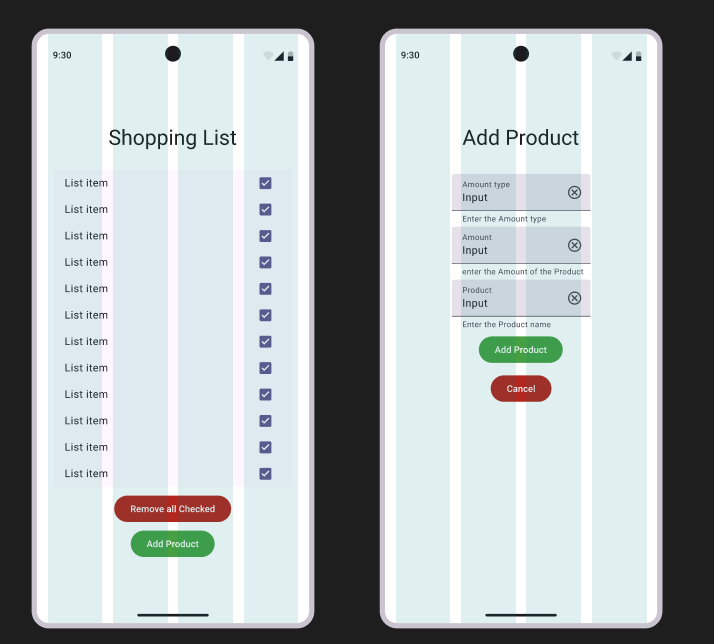

# 335-Shoppinglist
## Task
**Anforderungen**

 Sie haben den Auftrag, eine Einkaufslisten-App zu programmieren. In der App
kann der Benutzer speichern,

- welches Produkt (z.B. Milch, Käse, Müesli)
-  in welcher Quantität (e.g. Zahl, oder 500gr, oder 4 Scheiben)
-  wo (z.B. Metzg, Minor, Laldi) 

eingekauft werden soll.

- Die App soll die aktuelle Einkaufliste übersichtlich darstellen.
- Eingekaufte Artikel kann man durch "Abhaken" von der Listenansicht entfernen
- Die Datenhaltung soll zunächst lokal erfolgen. Die App muss auf Mobilgeräten
mit Android-8 und besser sowohl im Hoch- als auch im Querformat einwandfrei
funktionieren.
## User Stories 

### **User Story 1**  
**As a user, I want to add a specific amount of a product to my shopping list so that I can keep track of what I need to buy.**  

#### **Acceptance Criteria**  
- The user must be able to add a product by specifying its name.  
- The user must be able to add a specific quantity of the product (e.g., slices, grams, amount).  
- If the product cannot be added, an error message must be displayed.  

---

### **User Story 2**  
**As a user, I want to see a list of the products I have added so that I can have an overview of my shopping list.**  

#### **Acceptance Criteria**  
- The shopping list must display all added products, including their name, quantity, and location.  
- The list must be clear and structured to ensure easy readability.  
- If no products have been added, an appropriate message should be shown (e.g., "Your shopping list is empty.").  

---

### **User Story 3**  
**As a user, I want to remove purchased items from my shopping list by marking them as bought so that I can keep my list up to date.**  

#### **Acceptance Criteria**  
- The user must be able to mark an item as "bought."  
- Marked items should be removed from the main shopping list view.  
- There should be a way to restore mistakenly removed items (e.g., an "Undo" option or a separate history list).  

---

### **User Story 4**  
**As a user, I want the app to store my shopping list locally so that my data remains available even after closing the app.**  

#### **Acceptance Criteria**  
- The shopping list must be saved locally on the device.  
- When reopening the app, all previously added products must still be available.  
- The data should persist across app restarts without requiring an internet connection.  

---

### **User Story 5**  
**As a user, I want the app to work in both portrait and landscape mode so that I can use it comfortably on my mobile device.**  

#### **Acceptance Criteria**  
- The app layout must adapt correctly to both portrait and landscape orientations.  
- All UI elements must remain visible and functional in both modes.  
- No data should be lost when switching between orientations.  

## Wireframe

## Testplan
- Device: Android devices (Android 8 and above)
- Screen Modes: Portrait & Landscape
- Storage: Local device storage
- Test Tools: Manual Testing
---

### Test Cases 

| Test Description | Steps | Expected Result | Status |
|-----------------|-------|----------------|--------|
| **Add a product with a name** | 1. Open the app. 2. Enter "Milk" in the product name field. 3. Click "Add". | "Milk" appears in the shopping list. | [ ] |
| **Add a product with a specific quantity** | 1. Open the app. 2. Enter "Cheese" in the product name field. 3. Enter "500g" in the quantity field. 4. Click "Add". | "Cheese - 500g" appears in the shopping list. | [ ] |
| **Add a product with a location** | 1. Open the app. 2. Enter "Bread" in the product name field. 3. Enter "2 loaves" in the quantity field. 4. Enter "Bakery" in the location field. 5. Click "Add". | "Bread - 2 loaves (Bakery)" appears in the shopping list. | [ ] |
| **Attempt to add a product with a missing name** | 1. Open the app. 2. Leave the product name blank. 3. Enter "1L" in the quantity field. 4. Click "Add". | Error message: "Product name is required." | [ ] |
| **View added items in the shopping list** | 1. Add multiple products (e.g., "Milk - 1L", "Cheese - 500g", "Bread - Bakery"). 2. Navigate to the shopping list view. | The list displays all added products with name, quantity, and location. | [ ] |
| **View shopping list when empty** | 1. Ensure no products are in the list. 2. Open the shopping list view. | Message: "Your shopping list is empty." | [ ] |
| **Mark an item as bought** | 1. Add "Eggs - 10pcs" to the list. 2. Tap on the checkbox or "Mark as Bought" button. | "Eggs - 10pcs" disappears from the shopping list. | [ ] |
| **Undo a mistakenly removed item** | 1. Add "Butter - 250g" to the list. 2. Mark it as bought. 3. Click the "Undo" button. | "Butter - 250g" reappears in the shopping list. | [ ] |
| **Restart the app and check if items persist** | 1. Add "Bananas - 1kg" to the list. 2. Close the app. 3. Reopen the app. | "Bananas - 1kg" is still present in the shopping list. | [ ] |
| **Add multiple products, then restart** | 1. Add "Milk", "Cheese", and "Bread". 2. Close and reopen the app. | All products remain in the shopping list. | [ ] |
| **Check app layout in portrait mode** | 1. Open the app in portrait mode. | All UI elements are visible and correctly positioned. | [ ] |
| **Check app layout in landscape mode** | 1. Open the app in landscape mode. | All UI elements are visible and correctly positioned. | [ ] |
| **Switch between portrait and landscape modes** | 1. Open the app in portrait mode. 2. Add an item. 3. Switch to landscape mode. | The list remains visible, and no data is lost. | [ ] |

---
